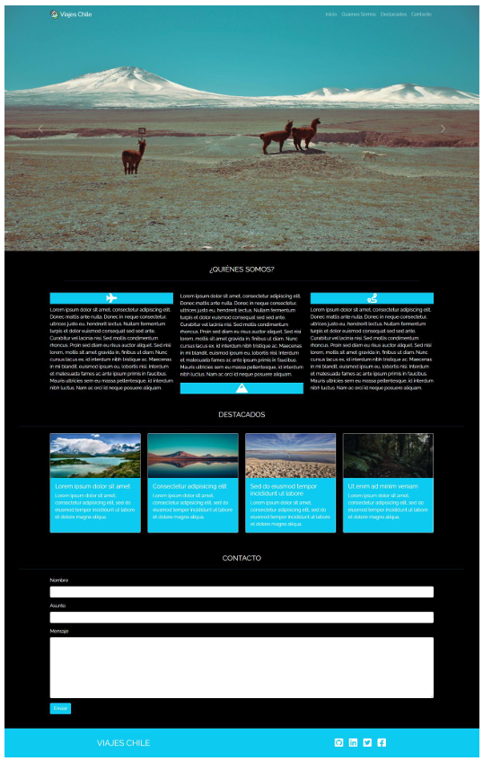

# Prueba final del primer modulo "Fundamentos del desarrollo Front-End"
Para realizar esta prueba debí haber estudiado previamente todo el material
disponible en el LMS correspondiente al módulo.
## Capítulos
- Introducción a HTML.
- Crear páginas con HTML.
- Introducción a CSS.
- Añadiendo CSS al proyecto.
- Introducción a Bootstrap.
- Integrando Bootstrap.
- Usando Bootstrap para personalizar el proyecto.
- Componentes avanzados de Bootstrap.
- Introducción a JavaScript.
- Operaciones con JavaScript.
- Integrando jQuery.
- Bootstrap JS.
- Terminal y manejo de archivos.
- Introducción a Git.
- Introducción a Github.
- Trabajando con Git y Github.
## Descripción
Para poder crear mi pagina landing Viajes Chile y que fuera igual al diseño de la maqueta tuve que agregar todo lo que se indica en en esta lista.
* Una barra de navegación fija en la parte superior de la pantalla, con el logo y links a
diferentes secciones de la página, haciendo un smooth scroll.
* Un carousel que muestre las imágenes destacadas del sitio.
* Una sección de presentación, utilizando favicons y 3 párrafos (debe desaparecer en
tamaños pequeños de pantalla).
* Una sección de destacados, que muestre 4 cards (tarjetas) con la imagen e
información asociada.
* Una sección de formulario de contacto.
* Una sección footer con links a las redes sociales.
## Maqueta

## Mi pagina
https://wintterbiird.github.io/Viajes-Chile-DanielaVZ/

